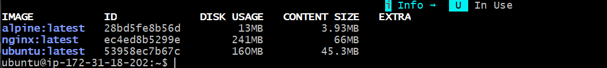
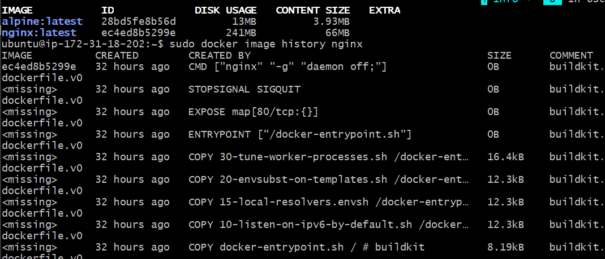
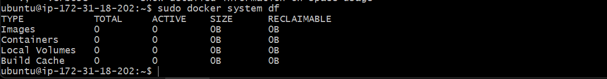

# Day 30 – Docker Images & Container Lifecycle

## Task 1: Docker Images

### Pull Images

```bash
sudo docker pull nginx
sudo docker pull ubuntu
sudo docker pull alpine
```

### List Images

```bash
sudo docker images
```

### Compare Ubuntu vs Alpine

* **Ubuntu** is larger because it includes many packages and utilities.
* **Alpine** is much smaller because it is a lightweight Linux distribution designed for containers.

### Inspect an Image

```bash
sudo docker inspect nginx
```

This command shows metadata such as:

* Image ID
* Environment Variables
* Layers
* Architecture
* Creation Date

### Remove Images

```bash
sudo docker rmi alpine
sudo docker rmi nginx
sudo docker rmi ubuntu
```

If an image is attached to a stopped container:

```bash
sudo docker rm <container_id>
sudo docker rmi ubuntu
```

---

## Task 2: Docker Image Layers

### View Image History

```bash
sudo docker image history nginx
```

### Observations

* Each line in the output represents a layer.
* Layers help Docker:

  * Reuse cached data
  * Build images faster
  * Reduce storage usage
  * Share common layers between images

---

## Task 3: Container Lifecycle

### Create a Container

```bash
sudo docker create ubuntu
```

### Check Status

```bash
sudo docker ps -a
```

### Start Container

```bash
sudo docker start <container_id>
```

### Pause Container

```bash
sudo docker pause <container_id>
```

### Unpause Container

```bash
sudo docker unpause <container_id>
```

### Stop Container

```bash
sudo docker stop <container_id>

### Restart Container


```bash
sudo docker restart <container_id>

```

### Kill Container

```bash

sudo docker kill <container_id>
```


### Remove Container


```bash

sudo docker rm <container_id>
```


### View Container States

```bash
sudo docker ps -a

```

**Note:** Screenshots for Task 3 were skipped.

---


## Task 4: Working with Running Containers

### Run Nginx Container

```bash
sudo docker run -d nginx
```

### View Logs

```bash
sudo docker logs <container_id>
```

### Follow Logs in Real Time

```bash
sudo docker logs -f <container_id>
```

Exit logs:

```text
Ctrl + C
```

### Access Container Shell

```bash
sudo docker exec -it <container_id> sh
```

### Execute Single Command

```bash
sudo docker exec <container_id> ls /usr/share/nginx/html
```

### Inspect Container

```bash
sudo docker inspect <container_id>
```

### Get Container IP Address

```bash
sudo docker inspect -f '{{.NetworkSettings.IPAddress}}' <container_id>
```

### Check Port Mapping

```bash
sudo docker port <container_id>
```

No output was shown because the container was started without exposing ports.

### Check Mounts

```bash
sudo docker inspect -f '{{json .Mounts}}' <container_id>
```

---

## Task 5: Cleanup

### Stop All Running Containers

```bash
sudo docker stop $(sudo docker ps -q)
```

### Remove Stopped Containers

```bash
sudo docker container prune -f
```

### Remove Unused Resources

```bash
sudo docker system prune -a
```

### Check Docker Disk Usage

```bash
sudo docker system df
```

---

# Screenshots

## SS1 – Docker Images



---

## SS2 – Nginx Image History



---

## SS3 – Container Logs


---

## SS4 – Docker Disk Usage



---

# Key Learnings

* Docker images are templates.
* Containers are running instances of images.
* Docker layers improve storage efficiency and caching.
* Containers move through different states during their lifecycle.
* Docker provides commands to inspect, monitor, and clean up resources effectively.

