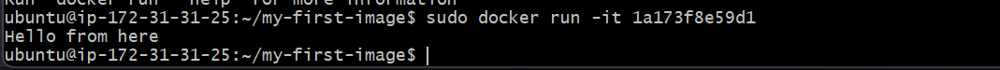
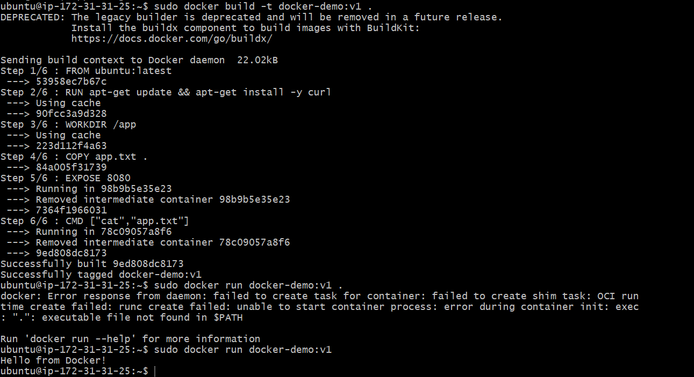
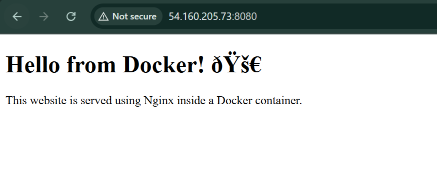

# Day 31 – Dockerfile: Build Your Own Images

## Task

Today's goal was to write Dockerfiles and build custom Docker images while understanding how Docker images are created and executed.

---

## Task 1: Your First Dockerfile

### Dockerfile

```dockerfile
FROM ubuntu

RUN apt-get update && apt-get install -y curl

CMD ["echo","Hello from my custom image!"]
```

### Build Image

```bash
sudo docker build -t my-ubuntu:v1 .
```

### Run Container

```bash
sudo docker run my-ubuntu:v1
```

### Output

Hello from my custom image!

### Screenshot



---

## Task 2: Dockerfile Instructions

### Dockerfile

```dockerfile
FROM ubuntu

RUN apt-get update && apt-get install -y curl

WORKDIR /app

COPY app.txt .

EXPOSE 8080

CMD ["cat","app.txt"]
```

### Build

```bash
sudo docker build -t docker-demo:v1 .
```

### Run

```bash
sudo docker run docker-demo:v1
```

### Screenshot



---

## Dockerfile Instructions Explained

| Instruction | Description                    |
| ----------- | ------------------------------ |
| FROM        | Base image                     |
| RUN         | Executes commands during build |
| COPY        | Copies files into image        |
| WORKDIR     | Sets working directory         |
| EXPOSE      | Documents port                 |
| CMD         | Default command                |

---

## Task 3: CMD vs ENTRYPOINT

### CMD

```dockerfile
FROM ubuntu
CMD ["echo","hello"]
```

* Default command can be overridden
* Example:

```bash
docker run cmd-demo:v1 ls
```

---

### ENTRYPOINT

```dockerfile
FROM ubuntu
ENTRYPOINT ["echo"]
```

* Fixed command
* Only arguments change

Example:

```bash
docker run entry-demo:v1 hello
docker run entry-demo:v1 Docker Rocks!
```

---

## Task 4: Nginx Web App

### index.html

Simple static webpage served using Nginx.

### Dockerfile

```dockerfile
FROM nginx:alpine

COPY index.html /usr/share/nginx/html/

EXPOSE 80
```

### Build

```bash
sudo docker build -t my-website:v1 .
```

### Run

```bash
sudo docker run -d -p 8080:80 my-website:v1
```

### Access

```
http://<EC2-Public-IP>:8080
```

### Screenshot



---

## Task 5: .dockerignore

```text
.git
*.md
.env
node_modules
```

### Purpose

Excludes unnecessary files from Docker build context to make builds faster and images smaller.

---

## Task 6: Build Optimization

Docker uses **layer caching**.

If a layer does not change, Docker reuses it instead of rebuilding.


